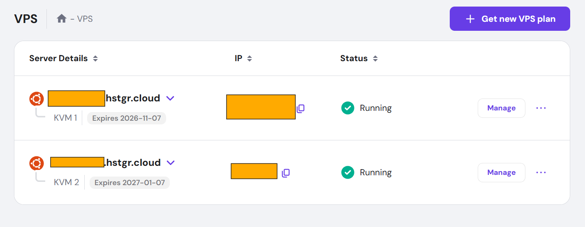
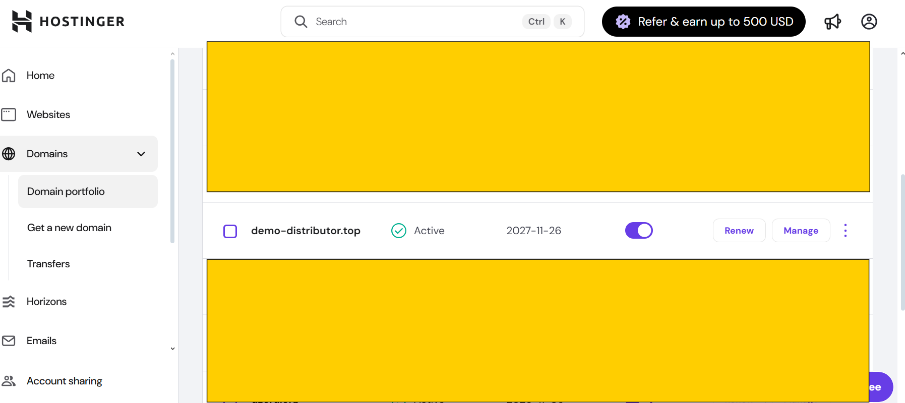
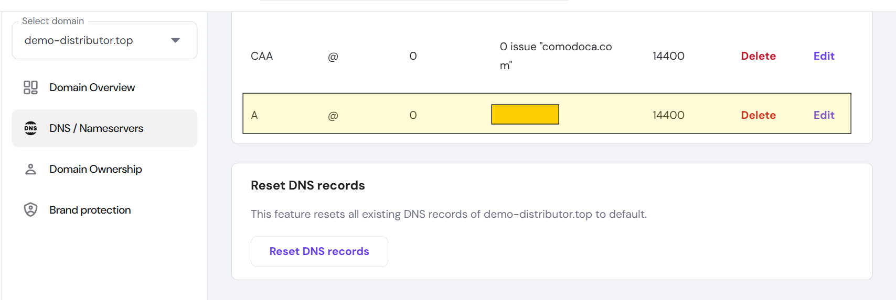
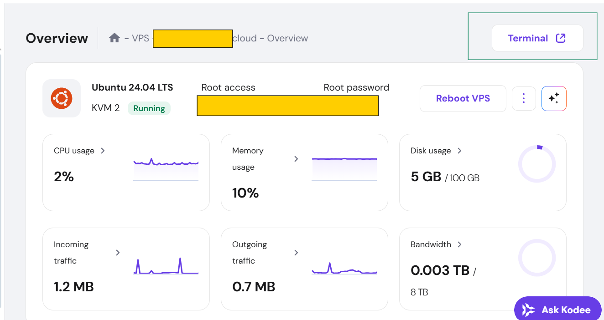
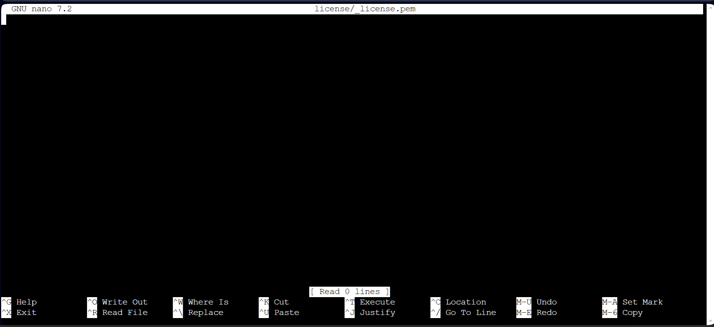
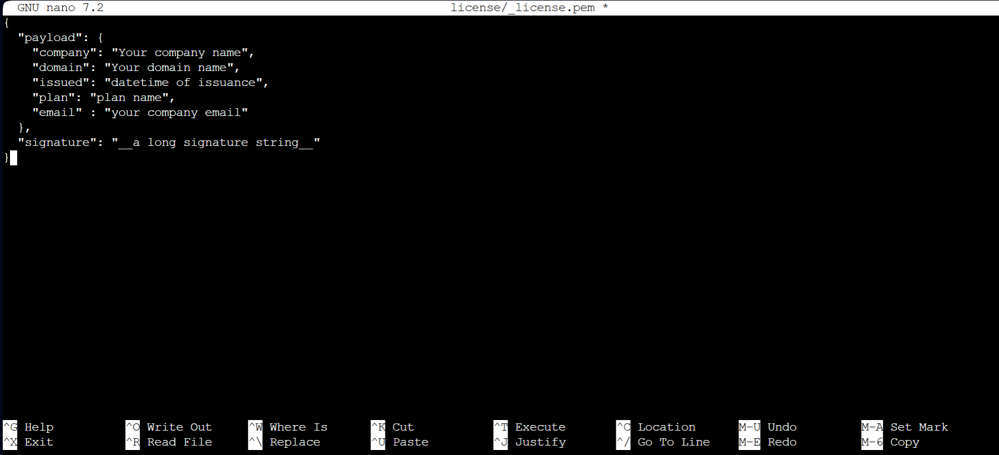

# Distributor Deployment

This repository contains the deployment assets, docker-compose configuration and helper scripts used to install and run the Distributor application on a VPS host.

Once You Puchase our application we will do the installation process for you. Incase you want to do it yourself, follow the `Self Installation Guide` below.

# Prerequisites

### 1. VPS hosting

You can buy VPS hosting from any provider. Our minimum recommendation for production is:

- 1 vCPU core
- 4 GB RAM
- 50 GB NVMe disk
- 4 TB bandwidth (or suitable for your expected traffic)
- OS: a recent Ubuntu LTS, Choose from `Plain Os`, Ubuntu is necessary, because installing several packages has different approach in different OS

If you want a quick option, you can use Hostinger (referral). Click the badge below to open the referral link:

[](https://www.hostinger.com/cart?product=vps%3Avps_kvm_1&period=12&referral_type=cart_link&REFERRALCODE=ZVZANGREDOFQ&referral_id=019a68e1-7338-71b1-b03f-2ebcb6ae13e5)

After purchasing the VPS, your provider will show you the VPS you have.



Keep the ip address noted, you will need in next step.

### 2. Buy a domain for your company.

Your domain will be displayed, by the domain provider.



### 3. DNS pointed to your VPS public IP

Click on *manage* of the domain, and got to *DNS / Nameservers* in order to point to your VPS IP address.

You will find many DNS records there, one of them is A Record, by default pointing to an ip address.
- Delete default A record
- Create New A record point to *IP Address* that your VPS has.
- A CNAME record poin to *domain* (Normally, This should already have in your domain DNS Record, Just make sure it is available, otherwise create one). To Create CNAME rocord, name: www, priority: 0, target: your domain, TTL: 300, and Save. 



Thats all, Now your Domain and VPS hosting is ready to install the application.

# Self Installation Guide

### 1. Access the VPS terminal
There, are many ways you can access to your VPS terminal.
- Using ssh
- Using a keygen
- Or some providers like *Hostinger* provide *Web Terminal*

By far the easiest is to use *Web Terminal*, We also following the same.

Again, Go to Your VPS section, and click on *manage*.
Details of your VPS will be displayed, and You will find a button *Terminal* to access to web terminal.



Click on that, this will open a terminal, in another tab of your web browser. Which will again, display some information about your vps, we are not interested on those details for now. Type *clear* and hit Enter. This will clear the terminal screen.
```bash
clear
```


### 2. Clone Repository
Clone this repository on your target VPS:

Paste this into the terminal (Right click > Paste)
```bash
git clone https://github.com/xitoss/distributor-deployment.git
```
This will create a directory named "distributor-deployment". All deployment related source code is inside this directory.

Go inside the directory by:
```bash
cd distributor-deployment
```


### 3. Setup License
The application requires two license files in the `license/` folder:
- `license_public.pem` (already included)
- `license.pem` (you will create this from the provided license file)

When you purchased this product, we sent you a license file (e.g., `company_license.pem` or `license.pem`). This file contains your company information and looks like this:
```json
{
  "payload": {
    "company": "Your company name",
    "domain": "Your domain name",
    "issued": "datetime of issuance",
    "plan": "plan name",
    "email" : "your company email"
  },
  "signature": "__a long signature string__"
}
```

⚠️ **Important**: Do not modify any of the license contents!

To install your license:

#### A. On your local computer:
   - Open the license file we sent you using Notepad or any text editor
   - Select everything (Ctrl+A) and copy it (Ctrl+C)

#### B. On your VPS terminal:
   ```bash
   nano license/_license.pem
   ```
   This will open the _license.pem file (which will be completely blank initially.)

   

   **To paste content, Right click and then Paste as plain text**
   
   After pasting the terminal will look like this

   

   
   When pasting your license content, make sure to:
   - Include all the content (the entire JSON with payload and signature)
   - Keep all quotes and brackets exactly as they are

   Save the file by:
   - CTRL + x [will ask "Save modified buffer?"]
   - Enter "Y" to the question.
   - Filename to write: license/_license.pem
   - Hit "Enter"
   This will close "nano" with update _license.pem 

#### C. Rename the file to **license.pem**:
   ```bash
   mv license/_license.pem license/license.pem
   ```
   This removes the underscore (_) from the filename.

### 4. Initialize your VPS
In general VPS comes with installed necessary packages to host an application, but it is not gurranteed. In order to install this applicaiton you will need, python3+, docker-compose2+ and some other packages. To make sure, everything is available run this command:

```bash
bash scripts/initialize.sh
```
This will install 
- python 3.12
- python3.12-venv 
- python3-
- docker

#### Important! If you installed any other OS instead of Ubuntu in your VPS, make sure update the code inside initialize.sh. Because different OS has different way of installing docker and docker compose. 
```bash
# -------------------------------
# Install Docker + Docker Compose v2
# -------------------------------
echo "=== Docker + Docker Compose Setup ==="

if command -v docker &>/dev/null; then
    echo "Docker is already installed: $(docker --version)"
else
    echo "Installing Docker..."

    # If old files still available, docker will fail to install...
    # Remove old Docker versions if present
    sudo apt remove -y docker docker-engine docker.io containerd runc || true

    # Remove ALL old Docker repository configurations
    sudo rm -f /etc/apt/sources.list.d/docker.list
    sudo rm -f /etc/apt/sources.list.d/docker.sources
    sudo rm -f /etc/apt/keyrings/docker.asc
    sudo rm -f /etc/apt/keyrings/docker.gpg
    sudo rm -f /etc/apt/trusted.gpg.d/docker.gpg
    # Remove any Docker entries from main sources.list
    sudo sed -i '/download.docker.com/d' /etc/apt/sources.list

    # Add Docker's GPG key
    sudo install -m 0755 -d /etc/apt/keyrings
    sudo curl -fsSL https://download.docker.com/linux/ubuntu/gpg -o /etc/apt/keyrings/docker.asc
    sudo chmod a+r /etc/apt/keyrings/docker.asc

    # Add Docker repository (deb822 format)
    sudo tee /etc/apt/sources.list.d/docker.sources > /dev/null <<EOF
Types: deb
URIs: https://download.docker.com/linux/ubuntu
Suites: $(. /etc/os-release && echo "${UBUNTU_CODENAME:-$VERSION_CODENAME}")
Components: stable
Signed-By: /etc/apt/keyrings/docker.asc
EOF
```

### 5. Run Preflight Setup
The preflight script will create a `.env` file containing all necessary configuration. This file is critical for the application - please do not edit it manually unless you know what you're doing.

First activate virtual environment (This was created in Initialize your VPS). Run this command in terminal.

```bash
source venv/bin/activate
```
You will see (venv) added before your terminal line now. Which indicate virtual environment is active.


Run the preflight script:
```bash
python scripts/preflight.py
```

The script will ask for the following information:

1. **Main Domain**
   - Enter your domain without 'www' (e.g., if your site is www.example.com, enter `example.com`)
   - default `domain` from the license file

2. **Let's Encrypt Email**
   - Provide a valid email address for SSL certificate notifications
   - SSL renewal and security notifications will be sent to this address
   - default `email` from the license file

3. **Database Credentials**
   - Username (default: `distributor`)
   - Password (default: `generated from license file`)
   - ⚠️ Use a strong password in production!

4. **Admin (Superuser) Account**
   - Username (default: from license or `admin`)
   - Email (default: from license or `admin@example.com`)
   - Password (default: `generated from license file`)
   - ⚠️ Change the default password after first login!

The script will generate additional secure values automatically:
- Secret keys for Django
- Agent communication keys
- Allowed hosts configuration
- Database connection settings

If you make a mistake, you can run the preflight script again to start over.


### 5. Deploy the Application
Once you have your license and `.env` file ready, deploy the application:

```bash
docker compose up -d --build
```

The deployment process will:
1. Pull the application image
2. Set up the database
3. Initialize the agent service
4. Install and configure Nginx
5. Set up SSL certificates
6. Create your superuser account
7. Set up static files

This may take several minutes. Once complete, you can access:
- Main site: `https://www.yourdomain.com`
- Admin panel: `https://yourdomain.com/staff_panel`

### 6. Assign permission to application to necessary directories into the host.
In your server, only root user can have full permission to all directories in the host. Run the below command, which will give permission the application to write and read files inside /media and other necessary directories.
```bash
bash scripts/permission.sh
```


### Next Steps
1. Log in to the staff panel using your superuser credentials
2. Complete your company setup
3. Create employee accounts
4. Configure your company

For detailed instructions on using the application, please refer to the user manual available in the staff panel.

### Troubleshooting
- If the deployment fails, check the Docker logs:
  ```bash
  docker compose logs -f
  ```
- Ensure your domain's DNS is properly configured before deploying
- Make sure ports 80 and 443 are open on your firewall
- For additional help, refer to our support documentation or contact our support team

### Deactivating Virtual Environment
When you're done with the installation, you can deactivate the virtual environment:
```bash
deactivate
```